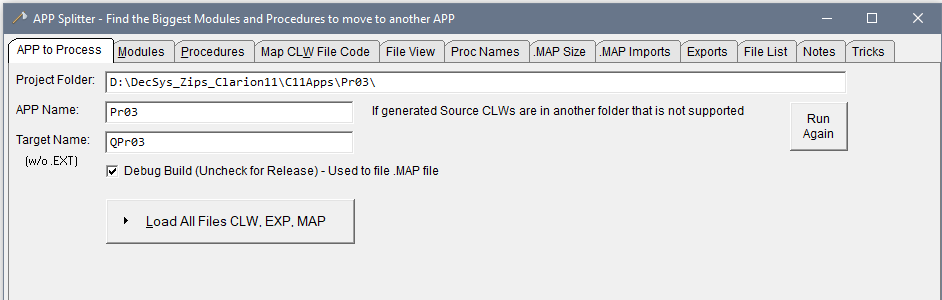
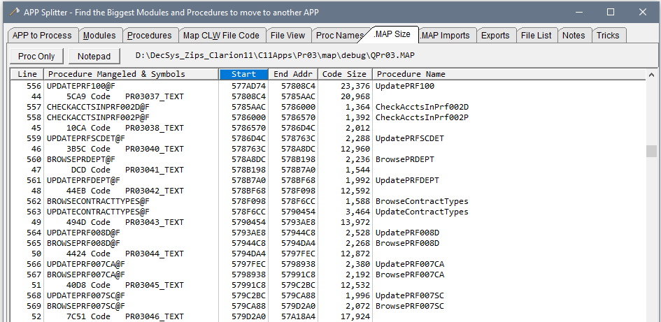

## APP-Splitter
 Analyze an APP to find large Modules and Procedures

Specify your Project Folder and APP name. The Target name is that of the EXE or DLL that is normally the same, but can be different as shown. Check the box for Debug or Release. Click the Load All button.

The **Modules tab** lists the Module CLW files, their size. Could Count and Procedure names. Click the column headings to sort. Normally you'll sort by size to work on the largest.

The **Procedures tab** lists all the procedures and their module. Click on the MAP size column to sort the largest procedures to the top. The MAP size is calculated using the Procedure's starting address in the Linker MAP file, and the address of the next symbol. If a Procedure shows Zero for size that would indicate it was not found in the MAP (see MAP Size tab to be sure). The Smart Linker removes any procedures that are not called nor exported. You could probably delete those. 

The **MAP Size** tab shows the parsed Linker Map that was used to find Procedure size.

The **MAP Imports** tab shows the LIB's imported by this APP and the Procedures Imported. This was from the Linker Map Imports section.

