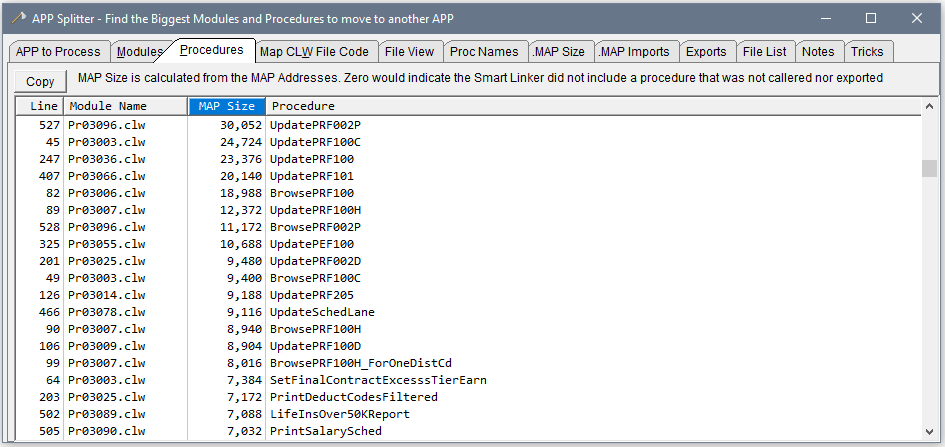

## APP-Splitter
 Analyze an APP to find large Modules and Procedures

Specify your Project Folder and APP name. The Target name is that of the EXE or DLL that is normally the same, but can be different as shown. Check the box for Debug or Release. Click the Load All button.

The **Modules tab** lists the Module CLW files, their size, Procedure Count and Procedure names. The size of the OBJ (object code) and RSC (resource e.g. window) files from the OBJ folder are show to give and idea of the compiled size of the modules as compared to the CLW size is the source code text. Click the column headings to sort. Normally you'll sort by size to work on the largest.

The **Procedures tab** lists all the procedures and their module. Click on the MAP size column to sort the largest procedures to the top. The MAP size is calculated using the Procedure's starting address in the Linker MAP file, and the address of the next symbol. If a Procedure shows Zero for size that would indicate it was not found in the MAP (see MAP Size tab to be sure). The Smart Linker removes any procedures that are not called nor exported. You could probably delete those.

An external procedure will show the DLL name in the Map Size column. If the external is not used it will show blank, i.e. it was declared in the Clw Map but was not called so does not appear in the Linker .MAP Imports section.

The **MAP Size** tab shows the parsed Linker Map. This is used to estimate Procedure size based on start and end address. The MAP only lists Start Address. I assume the address of the next "thing" ends the previous procedure, this may not always be correct but is a reasonable estimate.

The **MAP Imports** tab shows the LIB's imported by this APP and the Procedures Imported. This was from the Linker Map Imports section.

Shown during the [ClarionLive Open Webinar April 28, 2021 at time 37:20](https://www.youtube.com/watch?v=OLtKbH7-AR8&t=37m20s)
___
### New June 2025 - Open DLLs Button on MAP Imports Tab

To help resolve "Circular References" aka "Mutual Imports" the MAP Imports tab adds an "Open DLL" button. 
 It pops up a list of Imported DLLs that have a Clarion Map.

Below you see the popup shows UTBLG imports UT00, UTMnt and UTRec. 

Clicking on UTMNT opens that in App Splitter then displays the Imports tab with UTMNT selected and expanded.
 It shows that UTMNT imports 10 procedures from UTBLG. Using the two instances you can see all the Mutual Imports between UTBLG and UTMNT DLLs.

